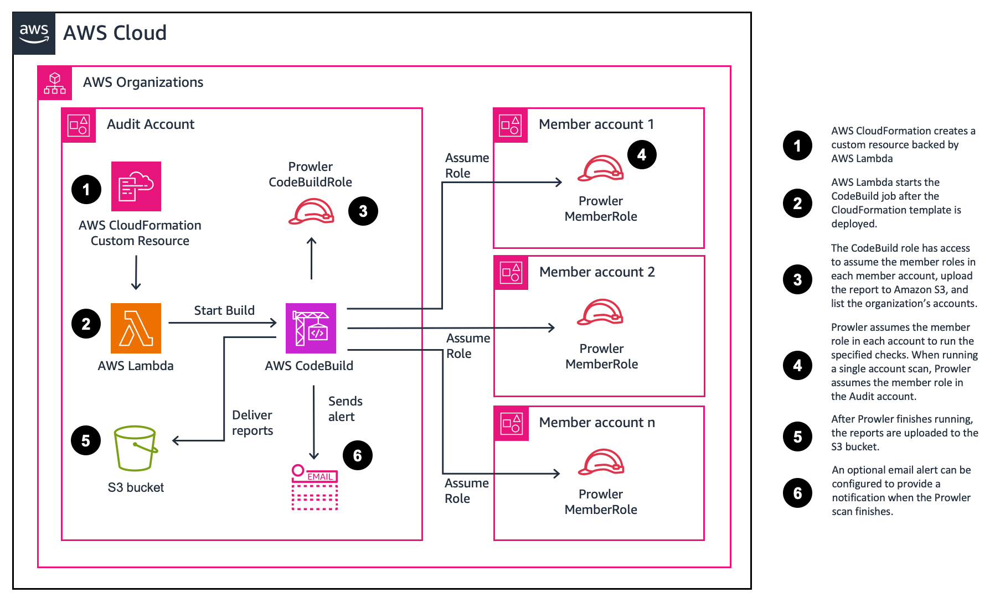

## Self-Service Security Assessment Solutions (v2.0)

Cybersecurity remains a very important topic and point of concern for many CIOs, CISOs, and their customers. To meet these important concerns, AWS has developed a primary set of services customers should use to aid in protecting their accounts. [Amazon GuardDuty](https://aws.amazon.com/guardduty/), [AWS Security Hub](https://aws.amazon.com/security-hub/), [AWS Config](https://aws.amazon.com/config/), and [AWS Well-Architected](https://aws.amazon.com/architecture/well-architected/?wa-lens-whitepapers.sort-by=item.additionalFields.sortDate&wa-lens-whitepapers.sort-order=desc&wa-guidance-whitepapers.sort-by=item.additionalFields.sortDate&wa-guidance-whitepapers.sort-order=desc) reviews help customers maintain a strong security posture over their AWS accounts. As more organizations deploy to the cloud, especially if they are doing so quickly, and they have not yet implemented the recommended AWS Services, there may be a need to conduct a rapid security assessment of the cloud environment.

We have developed an inexpensive, easy to deploy, secure, and fast solution to provide our customers with a security assessment report. These reports are generated using the open source project [Prowler](https://github.com/toniblyx/prowler). Prowler performs point in time security assessment based on AWS best practices and can help quickly identify any potential risk areas in a customer’s deployed environment. If you are interested in conducting these assessments on a continuous basis, AWS recommends enabling Security Hub’s [Foundational Security Best Practices standard](https://docs.aws.amazon.com/securityhub/latest/userguide/securityhub-standards-fsbp.html). If you are interested in integrating your Prowler assessment results with Security Hub, you can follow the instructions in the [Prowler Documentation](https://docs.prowler.cloud/en/latest/tutorials/aws/securityhub/).

>Note: Prowler is not an AWS owned solution. Customers should independently review Prowler before running this solution. Any dependencies associated with Prowler should be kept up to date. This solution installs the latest version available from pip package installer.

## Overview
The solution is deployed with [AWS CloudFormation](https://aws.amazon.com/cloudformation/). When deployed, an [AWS CodeBuild](https://aws.amazon.com/codebuild/) project and an [Amazon S3](https://aws.amazon.com/s3/) bucket to store the Prowler generated reports are created. An [AWS Lambda](https://aws.amazon.com/lambda/) function is then used to start the AWS CodeBuild project. 

The parameter (user input) defaults will run a basic scan in a single account. However, you can choose different parameters to run more extensive scans or to scan multiple accounts. The deployment process takes less than 5 minutes to complete. The solution’s AWS CloudFormation templates are provided for review in this Github repository.

Once the template is deployed, the CodeBuild project will run. The default assessment takes around 5 minutes to complete. The time to complete a security assessment will vary depending on the number of resources and the scan options selected. At the end of the assessments the reports are delivered to the created S3 Bucket.



## Deployment
You can use this project to run Prowler across multiple accounts in an AWS Organization, or a single account. We provide instructions to use  AWS CloudShell or the AWS console. Choose an option to get started.

|Deployment Type|AWS CloudShell|AWS console|
| --- | --- | --- |
| Single account | [Link](#aws-cloudshell) | [Link](#aws-console) |
| Multi-account | [Link](#aws-cloudshell-1) | [Link](#aws-console-1) |


## Single account scan
To run the Self-Service Security Assessment solution (SATv2) against a single account, follow the instructions below. You can choose to use the AWS CLI or the AWS Console.

#### AWS CloudShell

<details>
    <summary>Show steps</summary>

#### Deploy the solution

1. Login to your AWS account.
   
2. In the navigation bar, choose [AWS CloudShell](https://console.aws.amazon.com/cloudshell/home).
   
3. To download the CloudFormation template, enter the following command.
    ```bash
    wget https://raw.githubusercontent.com/awslabs/aws-security-assessment-solution/main/2-sat2-codebuild-prowler.yaml
    ```

4. To deploy the CloudFormation template, enter the following command.
   
    ```bash
    aws cloudformation deploy --template-file 2-sat2-codebuild-prowler.yaml --stack-name sat2 --capabilities CAPABILITY_NAMED_IAM
    ```

</details>

    
#### AWS Console

<details>
    <summary>Show steps</summary>

#### Deploy the solution

1. Download the [2-sat2-codebuild-prowler.yaml](https://github.com/awslabs/aws-security-assessment-solution/blob/main/2-sat2-codebuild-prowler.yaml) CloudFormation template.
2. Navigate to the [AWS CloudFormation console](https://console.aws.amazon.com/cloudformation).
3. In the navigation pane, choose **Stacks**.
4. Choose **Create stack**.
5. Under Specify template, select **Upload a template file**.
6. Choose **Next**.
7. For Stack name, enter **sat2**.
8. Choose **Next**.
9.  On the Configure stack options page, choose **Next**. 
10. On the Review SAS page, select the box **I acknowledge that AWS CloudFormation might create IAM resources.** and choose **Submit**.

</details>


## Multi-account scan
Self-Service Security Assessment solution (SAT) also supports multi-account scans. You must deploy a prerequisite role to each account you want to perform the scan on. To run SATv2 for multiple accounts, follow the instructions below. You can choose to use the AWS CLI or the AWS Console.

These instructions assume you already have the prerequisites for stack set operations. For more information, visit the [AWS CloudFormation User Guide](https://docs.aws.amazon.com/AWSCloudFormation/latest/UserGuide/stacksets-prereqs.html).

>Note: StackSets don't apply to the management account. To assess the management account, deploy the 1-sat2-member-role as a CloudFormation Stack.

#### AWS CloudShell

<details>
    <summary>Show steps</summary>

#### Step 1: Deploy prerequisite role

1. Login to your AWS Management account.
2. In the navigation bar, choose [AWS CloudShell](https://console.aws.amazon.com/cloudshell/home).
3. Identify which account you will run the Prowler scan from. Customers typically use a security tooling account, or audit account. Take note of the account ID for the **ProwlerAccountID** parameter.
4. To download the CloudFormation template, enter the following command.

    ```bash
    wget https://raw.githubusercontent.com/awslabs/aws-security-assessment-solution/main/1-sat2-member-roles.yaml
    ```


5. Deploy the CloudFormation template via CloudFormation StackSets. Update the following parameters:
   - Replace **\<aws-account-id\>** with the account ID you will run Prowler from.
   - Replace **\<region\>** with the Region you want to deploy the template to.

    ```bash
    aws cloudformation create-stack-set --template-body file://1-sat2-member-roles.yaml \
    --stack-set-name sat2-member-roles \
    --permission-model SERVICE_MANAGED \
    --auto-deployment Enabled=true,RetainStacksOnAccountRemoval=false \
    --capabilities CAPABILITY_NAMED_IAM \
    --parameters ParameterKey=ProwlerAccountID,ParameterValue=<aws-account-id> \
    --region <region>
    ```

6. Use the following command to create stack instances for each account in your organization. You can target a specific OU, or the root OU. Update the following parameters:
   - Replace **\<root-ou\>** with the [organization root ID](https://docs.aws.amazon.com/organizations/latest/userguide/orgs_manage_org_details.html#orgs_view_root). 
   - Replace **\<region\>** with the Region you want to deploy the template to.

    ```bash
    aws cloudformation create-stack-instances --stack-set-name sat2-member-roles \
    --deployment-targets OrganizationalUnitIds='["<root-ou>"]' \
    --regions '["<region>"]' \
    --operation-preferences FailureTolerancePercentage=100,MaxConcurrentPercentage=100 \
    --region <region>
    ```

7. Determine if you have delegated admin or a resource policy that already exists for your Prowler account. Only one option is needed and resource policy is encouraged as it is more granular.
   
    >Note: Resource policies are not available in GovCloud, so you will need to use a delegated admin.

    7a. Your Prowler account might already have a delegation. You can use the following commands to check:
 
    ```bash
    aws organizations list-delegated-administrators
    ```

    7b. Your Prowler account might already have a resource policy. You can use the following commands to check:
 
    ```bash
    aws organizations describe-resource-policy
    ```

8. If you don't have a delegated admin or a resource policy you can use the following commands to add the appropriate access.

    >Note: If you can't provide delegated ListAccount access, you can provide the MultiAccountListOverride parameter in the `2-sat2-codebuild-prowler template`.

    >Note: If you are using GovCloud, use step 8a to create a delegated admin. If you are using a commercial region, use step 8b to provide least privilege access to ListAccounts.

    8a. Use the following command to delegate an admin if you do not already have one. Replace **\<aws-account-id\>** with the account ID you will run Prowler from.

    ```bash
    aws organizations register-delegated-administrator <aws-account-id>
    ```
    
    8b. Use the following commands to add a resource policy.

    - Replace **\<aws-account-id\>** with the account ID you will run Prowler from.

        ```bash
        aws organizations put-resource-policy --content \
        '{
            "Version": "2012-10-17",
            "Statement": [
            {
                "Sid": "Statement",
                "Effect": "Allow",
                "Principal": {
                "AWS": "arn:aws:iam::<aws-account-id>:root"
                },
                "Action": "organizations:ListAccounts",
                "Resource": "*"
            }
            ]
        }'
        ```
#### Step 2: Deploy the SATv2 solution

>Note: Make sure you switched to the account you specified will run Prowler.

1. To download the template, open AWS CloudShell in the **Prowler account** and enter the following command.

    ```bash
    wget https://raw.githubusercontent.com/awslabs/aws-security-assessment-solution/main/2-sat2-codebuild-prowler.yaml
    ```

2. To deploy the template in the Prowler account. Set **MultiAccountScan** to **true** to scan all the accounts in your organization.

    ```bash
    aws cloudformation deploy --template-file 2-sat2-codebuild-prowler.yaml \
    --stack-name sat2-prowler \
    --capabilities CAPABILITY_NAMED_IAM \
    --parameter-overrides MultiAccountScan=true
    ```

</details>

#### AWS Console

<details>
    <summary>Show steps</summary>


#### Step 1: Deploy prerequisite role

1. Download the **1-sat2-member-roles.yaml** and **2-sat2-codebuild-prowler.yaml** files.
   
2. Deploy the CloudFormation template via CloudFormation StackSets. Update the following parameters:
   - Replace \<aws-account-id\> with the account ID you will run Prowler from.
   - Replace \<region\> with the Region you want to deploy the template to.
  
3. Navigate to the [AWS CloudFormation console](https://console.aws.amazon.com/cloudformation).
   
4. In the navigation pane, choose **StackSets**.
   
5. Choose **Create StackSet**.
   
6. For Permissions, leave **Service-managed permissions** selected.
   
7. Under Specify template, select **Upload a template file**.
   
8. Choose **1-sat2-member-roles.yaml** you downloaded in step 1-1.
   
9. Choose **Next**.
    
10. For Stack name, enter **sat2-member-role**.
    
11. For Parameters, enter the following:
      - ProwlerAccountID - The account ID you will run Prowler from.
  
12. Choose **Next**.
    
13. On the Configure StackSet options page, choose **Next**. 
    
14. On the Set deployment options, enter the following:
    1.  For **Deployment targets** leave **Deploy to organization** selected.
    2.  For **Specify regions**, choose **us-east-1**.
    3.  For **Region Concurrency**, choose **Parallel**.
    
15. Choose **Next**.
    
16. On the **Review** page, select the box **I acknowledge that AWS CloudFormation might create IAM resources.** and choose **Submit**.

#### Step 2: Deploy the SATv2 solution

1. Navigate to the [AWS CloudFormation console](https://console.aws.amazon.com/cloudformation) in the account you will run the tool from (ProwlerAccountID).
   
2. In the navigation pane, choose **Stacks**.
   
3. Choose **Create stack**.
   
4. Under Specify template, select **Upload a template file**.
   
5. Choose **Next**.
   
6. For Stack name, enter **sat2-prowler**.
   
7. Choose **Next**.
   
8.  On the Configure stack options page, choose **Next**. 
   
9.  On the Review SAS page, select the box **I acknowledge that AWS CloudFormation might create IAM resources.** and choose **Submit**.

</details>

## Review the results
After the solution is deployed, a Lambda function starts the CodeBuild project. After the CodeBuild project is finished building, the Prowler results will be uploaded to the created Amazon S3 bucket. If you configured [notifications](#notifications), you will get an email when the Prowler scan is complete.

If you didn't configure email alerts, you can monitor the progress from the [CodeBuild console](https://console.aws.amazon.com/codesuite/codebuild/projects).

To review the results, follow these steps.

1. Navigate to the Amazon S3 console in the account you deployed Prowler.

2. Select the bucket that starts with **sat2-prowler-prowlerfindingsbucket-**

3. Choose the folder with the date and time of the scan.

4. For each account, there will be 4 file types (csv, html, json, json-ocsf) in the format `prowler-output-<aws-account-id>-<datetime>`.

5. Select one of the html objects.

6. Choose **Open**.
   
   

7. A new window will open with your report. You can use the filters to identify and prioritize the findings.

   

## Scan types

By default, SAT2 will run a basic scan which includes 13 checks. You can choose to run an intermediate or full check by choosing a different ProwlerScanType parameter value.

For example

`aws cloudformation deploy --template-file 2-sat2-codebuild-prowler.yaml --stack-name sat2-prowler --capabilities CAPABILITY_NAMED_IAM --parameter-overrides ProwlerScanType=Intermediate`

### Basic Scan

- Manual check - Maintain current contact details.
- Find obsolete Lambda runtimes.
- Ensure CloudTrail is enabled in all regions 
- Ensure AWS Config is enabled in all regions. 
- Ensure no security groups allow ingress from 0.0.0.0/0 or ::/0 to any port. 
- Check if GuardDuty is enabled 
- Ensure IAM password policy require at least one lowercase letter 
- Ensure IAM password policy require at least one number 
- Ensure IAM password policy require at least one symbol 
- Ensure IAM password policy requires at least one uppercase letter 
- Ensure MFA is enabled for the root account 
- Ensure access keys are rotated every 90 days or less 
- Ensure there are no S3 buckets open to Everyone or Any AWS user. 

### Intermediate scan 

This scan will add `--severity critical high` to the Prowler scan options. With this selected Prowler will run all security checks that result in critical or high severity.

### Full scan

This option doesn't add any additional parameters to the Prowler scan. It will result in Prowler running the full 283 checks.

You can also use the full scan to customize the scan however you would like.

For **ProwlerScanType** choose **Full**.

For **ProwlerOptions**, append the check. For example, to check only if GuardDuty is enabled, enter:

`aws --ignore-exit-code-3 -c guardduty_is_enabled`

## Notifications

You can optionally specify an email address in the EmailAddress parameter when you deploy the CloudFormation template. This will create an SNS topic and send an email when the CodeBuild job completes. 

This may be helpful when running longer scans, or across many accounts.

For example, a single account scan with email notifications would use this command:

`aws cloudformation deploy --template-file 2-sat2-codebuild-prowler.yaml --stack-name sat2 --capabilities CAPABILITY_NAMED_IAM --parameter-overrides EmailAddress=email@domain.com`

With or without the optional EmailAddress parameter set, you can view the progress in the CodeBuild console.
1. Navigate to the [CodeSuite console](https://console.aws.amazon.com/codesuite/).

2. In the navigation pane, under **Build**, choose **Build projects**.

3. Choose the Build project that begins with **ProwlerCodeBuild-**.

4. Under Build history, you will see the last run. 

    

5. Optionally, you can choose **Start build** to run another scan with the options you choose when you deployed the solution.

## Frequently Asked Questions (FAQ)

1.	Is there a cost?
    + This solution is designed to run within [AWS Free Tier](https://aws.amazon.com/free/?all-free-tier.sort-by=item.additionalFields.SortRank&all-free-tier.sort-order=asc&awsf.Free%20Tier%20Types=*all&awsf.Free%20Tier%20Categories=*all). 
    + For [Amazon CodeBuild](https://aws.amazon.com/free/devops/?p=ft&z=subnav&loc=3), customer's get 100 build minutes per month. 
    + For customers that have already exceeded free tier with CodeBuild, S3, and Lambda, this solution costs less than $1 to run.
2.	Is this a continuous monitoring and reporting tool?
     + No. This is a one-time assessment, we recommend customers use [AWS Security Hub](https://aws.amazon.com/security-hub/) for continuous assessments.
3.	Does this integrate with GuardDuty, Security Hub, CloudWatch, etc.?
    + No. You can follow the instructions in [this blog](https://aws.amazon.com/blogs/security/use-aws-fargate-prowler-send-security-configuration-findings-about-aws-services-security-hub/) to integrate Prowler and Security Hub.
4.	How do I remediate the issues in the reports?
    + Generally, the issues should be described in the report with readily identifiable corrections. Please follow up with the public documentation for each tool (Prowler) as well. If this is insufficient, please reach out to your AWS Account team or [AWS Support](https://aws.amazon.com/contact-us/) to help you understand the reports and work towards remediating issues.

## Clean Up
After you run the solution, you should delete the CloudFormation Stacks to remove resources that are no longer needed. The S3 bucket with the Prowler scan results will remain.

To remove the security assessment solution from your account, follow these steps.

1. Navigate to the [AWS CloudFormation console](https://console.aws.amazon.com/cloudformation) in the account you ran the tool from (ProwlerAccountID).
   
2. In the navigation pane, choose **Stacks**.

3. Choose the **sat2-prowler** Stack.

4. Choose **Delete**.

If you deployed the member role StackSet to scan multiple accounts, follow these steps.

1. Navigate to the [AWS CloudFormation console](https://console.aws.amazon.com/cloudformation) in the account you created the member role StackSet.
   
2. In the navigation pane, choose **StackSets**.

3. Choose the **sat2-member-roles** StackSet.

4. Choose **Actions**, then **Delete stacks form StackSet**.

5. Specify the same **AWS OU ID** when you created the StackSet.

6. For **Specify regions**, choose **Add all regions**.

7. Choose **Next**, and **Submit**.

After change finishes, you can delete the StackSet.

1. Choose the **sat2-member-roles** StackSet.

2. Choose **Actions**, then **Delete StackSet**.

If you want to remove the Amazon S3 bucket with the scan results, follow the steps in the [Amazon S3 user guide](https://docs.aws.amazon.com/AmazonS3/latest/userguide/delete-bucket.html) to delete the objects and bucket. If you run the solution again, a new S3 bucket will be created for your results.

## Security

See [CONTRIBUTING](CONTRIBUTING.md#security-issue-notifications) for more information.

## License

This project is licensed under the Apache-2.0 License.
