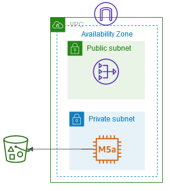

## Self-Service Security Assessment tool

Cybersecurity remains a very important topic and point of concern for many CIOs, CISOs, and their customers. To meet these important concerns, AWS has developed a primary set of services customers should use to aid in protecting their accounts. Amazon GuardDuty, AWS Security Hub, AWS Config, and AWS Well-Architected reviews help customers maintain a strong security posture over their AWS accounts. As more organizations deploy to the cloud, especially if they are doing so quickly, and they have not yet implemented the recommended AWS Services, there may be a need to conduct a rapid security assessment of the cloud environment.

With that in mind, we have worked to develop an inexpensive, easy to deploy, secure, and fast solution to provide our customers two (2) security assessment reports. These security assessments are from the open source projects “[Prowler](https://github.com/toniblyx/prowler)” and “[ScoutSuite](https://github.com/nccgroup/ScoutSuite).” Each of these projects conduct an assessment based on AWS best practices and can help quickly identify any potential risk areas in a customer’s deployed environment. If you are interested in conducting these assessments on a continuous basis, AWS recommends enabling Security Hub’s [Foundational Security Best Practices standard](https://docs.aws.amazon.com/securityhub/latest/userguide/securityhub-standards-fsbp.html). If you are interested in integrating your Prowler assessment results with Security Hub, you can also do that from Prowler natively following instructions [here](https://github.com/toniblyx/prowler#security-hub-integration).

In addition, we have developed custom modules that speak to customer concerns around threats and misconfigurations of those issues, currently this includes checks for ransomware specific findings.

# ARCHITECTURE OVERVIEW

## Overview - Open Source project checks
The architecture we deploy is a very simple VPC with two (2) subnets, one (1) NAT Gateway, one (1) EC2 instance, and one (1) S3 Bucket. The EC2 instance is using Amazon Linux 2 (the latest published AMI), that is patched on boot, pulls down the two projects (Prowler and ScoutSuite), runs the assessments and then delivers the reports to the S3 Bucket. The EC2 instances does not deploy with any EC2 Key Pair, does not have any open ingress rules on its Security Group, and is placed in the Private Subnet so it does not have direct internet access. After completion of the assessment and the delivery of the reports the system can be terminated.

The deployment is accomplished through the use of CloudFormation. A single CloudFormation template is used to launch a few other templates (in a modular approach). No parameters (user input) is required and the automated build out of the environment will take on average less than 10 minutes to complete. These templates are provided for review in this Github repository.

Once the EC2 Instance has been created and begins, the two assessments it will take somewhere around 40 minutes to complete. At the end of the assessments and after the two reports are delivered to the S3 Bucket the Instance will automatically shutdown, You may at this time safely terminate the Instance.

## How to deploy this tool
* See the [following guide](docs/how-to-deploy.md) on installation steps

## How do I read the reports?
* See the [following guide](docs/how-to-read-reports.md) on accessing and reading the report outputs

## Diagram
Here is a diagram of the architecture.

### What will be created

+ A VPC
    + This will be a /26 for the VPC
    + This will include 2 subnets both in the same Availability Zone, one Public and one Private
    + This will include the required Route Tables and ACLs

 + An EIP
    + For use by the NAT Gateway

 + A NAT Gateway
    + This is required for the instance to download both Prowler and ScoutSuite as well as to make the API Calls

 + A Security Group
    + For the Instance

 + A single m5a.large instance with a 10 GB gp2 EBS volume
    + This is the instance in which Prowler and ScoutSuite will run
    + It will be in a Private Subnet
    + It will not have an EC2 Key Pair
    + It will not allow ingress traffic  on the Security Group

 + An Instance Role
    + This Role is required so that Prowler and ScoutSuite can run the API calls from the EC2 Instance

 + An IAM Policy
    + Some IAM permissions are required for Prowler and ScoutSuite
      + Prowler info [here](https://github.com/toniblyx/prowler/blob/master/iam/prowler-additions-policy.json)
      + ScoutSuite info [here](https://github.com/nccgroup/ScoutSuite/wiki/Amazon-Web-Services#permissions)

 + An S3 Bucket
    + This is the location where the reports will be delivered
    + It will take about 40 minutes for the reports to show up

## Open source security Assessments

These security assessments are from the open source projects “Prowler” and “ScoutSuite.” Each of these projects conduct an assessment based on AWS best practices and can help quickly identify any potential risk areas in a customer’s deployed environment.

## 1. Prowler

The first assessment is from [Prowler](https://github.com/toniblyx/prowler).
+ Prowler follows guidelines of the CIS Amazon Web Services Foundations Benchmark (49 checks) and has 40 additional checks including related to GDPR and HIPAA, in total Prowler offers over 160 checks.

## 2. ScoutSuite

The second assessment is from [ScoutSuite](https://github.com/nccgroup/ScoutSuite)
+ ScoutSuite has been around since 2012, originally a Scout, then Scout2, and now ScoutSuite. This will provide a set of files that can be viewed in your browser and conducts a wide range of checks

## Overview - Optional Ransomware modules
When enabled, this module will deploy separate functions that can help customers with evaluating their environment for ransomware infection and susceptibility to ransomware damage.

### What will be created

+ AmazonLinux SSM scanner Lambda function
  + This Lambda function will illustrate how you can use SSM to scan an EC2 instance for file extensions that are associated with ransomeware infection.
+ AWS Core security services enabled
  + Checks for AWS security service enablement in all regions where applicable (GuardDuty, SecurityHub)
+ Data protection checks
  + Checks for EBS volumes with no snapshot
  + Checks for outdated OS running
  + Checks for S3 bucket replication JobStatus
  + Checks for EC2 instances that can not be managed with SSM
  + Checks for Stale IAM roles that have been granted S3 access but have not used them in the last 60 days
  + Checks for S3 deny public access enablement
  + Checks to see if DNSSEC is enabled for public hosted zones in Amazon Route 53
  + Checks to see if logging is enabled for services relevant to ransomware (i.e. CloudFront, Lambda, Route53 Query Logging, and Route 53 Resolver Logging).
  + Checks to see if Route 53 Resolver DNS Firewall is enabled across all relevant regions
  + Checks to see if there are any Access Keys that have not been used in last 90 days
## Overview - Optional SolarWinds module
  When enabled, this module will deploy separate functions that can help customers with evaluating their environment for SolarWinds vulnerability.  The checks are based on [CISA Alert AA20-352A](https://us-cert.cisa.gov/ncas/alerts/aa20-352a) from Appendix A & B.    

  `Note`: Prior to enablement of this module, please read the module [documentation](CloudFormation-Templates/modules/SolarWindsChecks/README.md) which reviews the steps that need to be completed prior to using this module.

  `Note`: This module **MUST** be run separately as its own stack, select the S3 URL SelfServiceSecSolar.yml to deploy

### What will be created
+ Athena query - AA20352A IP IOC
  + This Athena query will scan your VPC flow logs for IP addresses from the CISA AA20-352A.
+ SSM Automation document - SolorWindsAA20-352AAutomatedScanner
  + This is a systems manager automation document that will scan Windows EC2 instances for impacted .dll files from CISA AA20-352A.
+ Route53 DNS resolver query - AA20352A DNS IOC
  + This Athena query will scan your DNS logs for customers that have enabled [DNS query logging](https://docs.aws.amazon.com/Route53/latest/DeveloperGuide/query-logs.html)

# Frequently Asked Questions (FAQ)

1.	Is there a cost?
    + Yes. This should normally cost less than $1 for an hour of use.
2.	Is this a continuous monitoring and reporting tool?
     + No. This is a one-time assessment, we urge customers to leverage tooling like [AWS SecurityHub](https://aws.amazon.com/security-hub/) for Ongoing assessments.
3.	Why does the CloudFormation service error when deleting the stack?
     + You must remove the objects (reports) out of the S3 bucket first
4.	Does this integrate with GuardDuty, Security Hub, CloudWatch, etc.?
    + Not at this time. In a future sprint we plan to incorporate integration with AWS services like Security Hub and GuardDuty. However, you can follow the instructions in [this blog](https://aws.amazon.com/blogs/security/use-aws-fargate-prowler-send-security-configuration-findings-about-aws-services-security-hub/) to integrate Prowler and Security Hub.
5.	How do I remediate the issues in the reports?
    + Generally, the issues should be described in the report with readily identifiable corrections. Please follow up with the public documentation for each tool (Prowler and ScoutSuite) as well. If this is insufficient, please reach out to your AWS Account team and we will be more than happy to help you understand the reports and work towards remediating issues.

## Security

See [CONTRIBUTING](CONTRIBUTING.md#security-issue-notifications) for more information.

## License

This project is licensed under the Apache-2.0 License.
