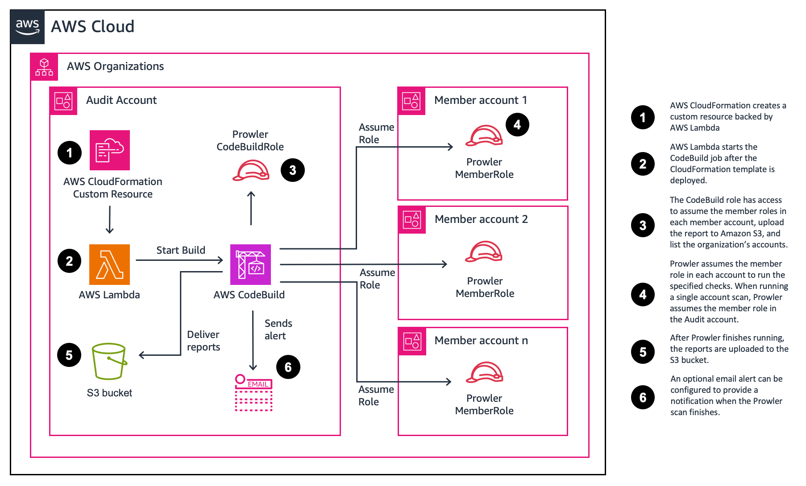
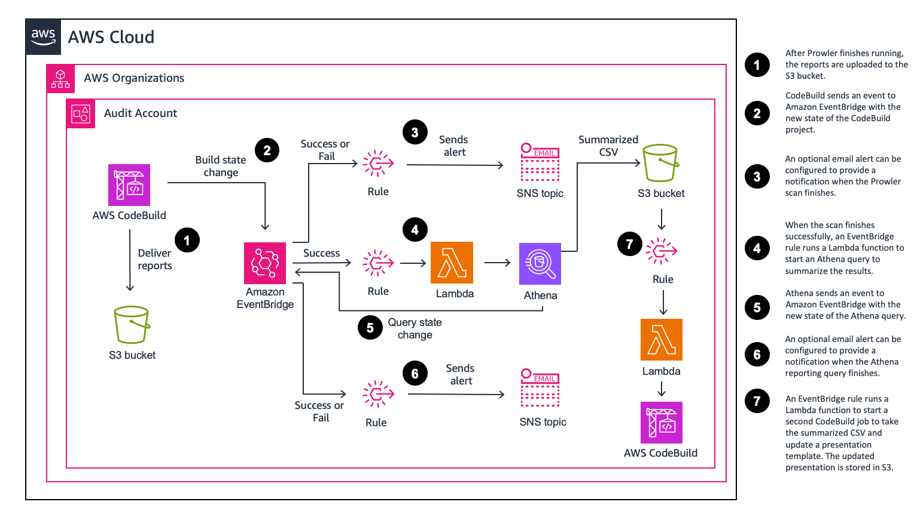

## Self-Service Security Assessment Solutions (v2.0)<!-- omit from toc -->

Cybersecurity remains a very important topic and point of concern for many CIOs, CISOs, and their customers. To meet these important concerns, AWS has developed a primary set of services customers should use to aid in protecting their accounts. [Amazon GuardDuty](https://aws.amazon.com/guardduty/), [AWS Security Hub](https://aws.amazon.com/security-hub/), [AWS Config](https://aws.amazon.com/config/), and [AWS Well-Architected](https://aws.amazon.com/architecture/well-architected/?wa-lens-whitepapers.sort-by=item.additionalFields.sortDate&wa-lens-whitepapers.sort-order=desc&wa-guidance-whitepapers.sort-by=item.additionalFields.sortDate&wa-guidance-whitepapers.sort-order=desc) reviews help customers maintain a strong security posture over their AWS accounts. As more organizations deploy to the cloud, especially if they are doing so quickly, and they have not yet implemented the recommended AWS Services, there may be a need to conduct a rapid security assessment of the cloud environment.

We have developed an inexpensive, easy to deploy, secure, and fast solution to provide our customers with a security assessment report. These reports are generated using the open source project [Prowler](https://github.com/prowler-cloud/prowler). Prowler performs point in time security assessment based on AWS best practices and can help quickly identify any potential risk areas in a customer’s deployed environment. If you are interested in conducting these assessments on a continuous basis, AWS recommends enabling Security Hub’s [Foundational Security Best Practices standard](https://docs.aws.amazon.com/securityhub/latest/userguide/securityhub-standards-fsbp.html). If you are interested in integrating your Prowler assessment results with Security Hub, you can follow the instructions in the [Prowler Documentation](https://docs.prowler.cloud/en/latest/tutorials/aws/securityhub/).

>Note: Prowler is not an AWS owned solution. Customers should independently review Prowler before running this solution. Any dependencies associated with Prowler should be kept up to date. This solution installs a pinned version of Prowler (currently 5.41.0) from the pip package installer, so that a change to Prowler's output format cannot break a scan without warning. To move to a newer release, edit the `pip3 install prowler==` line in `2-sat2-codebuild-prowler.yaml`.

📕 For more in depth step-by-step instructions, visit module 2 in the [SHIP Workshop](https://catalog.us-east-1.prod.workshops.aws/workshops/3bd6e4da-265a-4c79-ab47-639b7ef23c9d/en-US/20-satv2).

## Table of Contents<!-- omit from toc -->
- [Overview](#overview)
- [Parameters](#parameters)
- [Deployment](#deployment)
- [Single account scan](#single-account-scan)
  - [AWS CloudShell](#aws-cloudshell)
    - [Deploy the solution](#deploy-the-solution)
  - [AWS Console](#aws-console)
    - [Deploy the solution](#deploy-the-solution-1)
- [Multi-account scan](#multi-account-scan)
  - [AWS CloudShell](#aws-cloudshell-1)
    - [Step 1: Deploy prerequisite role](#step-1-deploy-prerequisite-role)
    - [Step 2: Deploy the SATv2 solution](#step-2-deploy-the-satv2-solution)
  - [AWS Console](#aws-console-1)
    - [Step 1: Deploy prerequisite role](#step-1-deploy-prerequisite-role-1)
    - [Step 2: Enable delegated administrator for AWS Organizations](#step-2-enable-delegated-administrator-for-aws-organizations)
    - [Step 3: Deploy the SATv2 solution](#step-3-deploy-the-satv2-solution)
- [Review the results](#review-the-results)
  - [SATv2 Dashboard (recommended)](#satv2-dashboard-recommended)
  - [Prowler Dashboard](#prowler-dashboard)
- [Scan types](#scan-types)
  - [Basic Scan](#basic-scan)
  - [Intermediate scan](#intermediate-scan)
  - [Full scan](#full-scan)
- [Notifications](#notifications)
- [Reporting Summary](#reporting-summary)
  - [How the Athena table is built](#how-the-athena-table-is-built)
  - [Scan history and duplicates](#scan-history-and-duplicates)
- [Frequently Asked Questions (FAQ)](#frequently-asked-questions-faq)
- [Clean Up](#clean-up)
- [Security](#security)
- [License](#license)

## Overview
The solution is deployed with [AWS CloudFormation](https://aws.amazon.com/cloudformation/). When deployed, an [AWS CodeBuild](https://aws.amazon.com/codebuild/) project and an [Amazon S3](https://aws.amazon.com/s3/) bucket to store the Prowler generated reports are created. An [AWS Lambda](https://aws.amazon.com/lambda/) function is then used to start the AWS CodeBuild project.

The parameter (user input) defaults will run a basic scan in a single account. However, you can choose different parameters to run more extensive scans or to scan multiple accounts. The deployment process takes less than 5 minutes to complete. The solution’s AWS CloudFormation templates are provided for review in this Github repository.

Once the template is deployed, the CodeBuild project will run. The default assessment takes around 5 minutes to complete. The time to complete a security assessment will vary depending on the number of resources and the scan options selected. At the end of the assessments the reports are delivered to the created S3 Bucket.



## Parameters
SATv2 can be customized by updating the CloudFormation parameters. This section summarizes the available options and provides a link to the section with more information.

| Parameter                | Description                                                                                                                                                                                                                                                                                                                               | More information                          |
| ------------------------ | ----------------------------------------------------------------------------------------------------------------------------------------------------------------------------------------------------------------------------------------------------------------------------------------------------------------------------------------- | ----------------------------------------- |
| ProwlerScanType          | Specify which type of scan to perform. Selecting full without specifying different ProwlerOptions will do a full scan. To perform a specific check, choose Full and append -c <check> to ProwlerOptions.                                                                                                                                  | [Scan types](#scan-types)                 |
| MultiAccountScan         | Set this to true if you want to scan all accounts in your organization. You must have deployed the prerequisite template to provision a role, or specify a different ProwlerRole with the appropriate permissions.                                                                                                                        | [Multi-account scan](#multi-account-scan) |
| Reporting                | Set this to true if you want to summarize the Prowler reports into a single csv. This is helpful when scanning multiple accounts.                                                                                                                                                                                                         | [Reporting Summary](#reporting-summary)   |
| EmailAddress             | Specify an address if you want to receive an email when the assessment completes.                                                                                                                                                                                                                                                         | [Notifications](#notifications)           |
| **Advanced Parameters**  |
| ConcurrentAccountScans   | For multi-account scans, specify the number of accounts to scan concurrently. This is useful for large organizations with many accounts. Selecting more than three changes the size of the CodeBuild instance and may incur additional costs.                                                                                             |
| CodeBuildTimeout         | Set the timeout for the CodeBuild job. The default is 300 minutes (5 hours).                                                                                                                                                                                                                                                              |
| MultiAccountListOverride | Specify a space delimited list of accounts to scan. Leaving this blank will scan all accounts in your organization. Ensure that you have set `MultiAccountScan` parameter above to true if you want to scan specific accounts. If you can't provide delegated ListAccount access, you can provide the MultiAccountListOverride parameter. | [Multi-account scan](#multi-account-scan) |
| ProwlerOptions           | Specify the parameters for Prowler. The --role and ARN will automatically be added to the end of the parameters you specify. This can also be used to specify a single check.                                                                                                                                                             | [Full scan](#full-scan)                   |
| ProwlerRole              | The role that Prowler should assume to perform the scan. Change this if you want to specify your own role with different permissions.                                                                                                                                                                                                     |


## Deployment
You can use this project to run Prowler across multiple accounts in an AWS Organization, or a single account. We provide instructions to use  AWS CloudShell or the AWS console. Choose an option to get started.

| Deployment Type | AWS CloudShell            | AWS console            |
| --------------- | ------------------------- | ---------------------- |
| Single account  | [Link](#aws-cloudshell)   | [Link](#aws-console)   |
| Multi-account   | [Link](#aws-cloudshell-1) | [Link](#aws-console-1) |


## Single account scan
To run the Self-Service Security Assessment solution (SATv2) against a single account, follow the instructions below. You can choose to use the AWS CLI or the AWS Console.

### AWS CloudShell

<details>
    <summary>Show steps</summary>

#### Deploy the solution

1. Login to your AWS account.

2. In the navigation bar, choose [AWS CloudShell](https://console.aws.amazon.com/cloudshell/home).

3. To download the CloudFormation template, enter the following command.
    ```bash
    wget https://raw.githubusercontent.com/awslabs/aws-security-assessment-solution/main/2-sat2-codebuild-prowler.yaml
    ```

4. To create an S3 bucket to stage the template, enter the following commands. The template is larger than 51,200 bytes, so CloudFormation requires it to be uploaded to S3 rather than passed inline.

    ```bash
    TEMPLATE_BUCKET=sat2-cfn-templates-$(aws sts get-caller-identity --query Account --output text)-$AWS_REGION
    aws s3 mb s3://$TEMPLATE_BUCKET --region $AWS_REGION
    ```

5. To deploy the CloudFormation template, enter the following command. The `--s3-bucket` option uploads the template to the bucket before creating the stack.

    ```bash
    aws cloudformation deploy --template-file 2-sat2-codebuild-prowler.yaml \
    --stack-name sat2 \
    --capabilities CAPABILITY_NAMED_IAM \
    --s3-bucket $TEMPLATE_BUCKET
    ```

6. After the stack is created, you can delete the staging bucket. It is only used to hand the template to CloudFormation.

    ```bash
    aws s3 rb s3://$TEMPLATE_BUCKET --force
    ```

</details>


### AWS Console

<details>
    <summary>Show steps</summary>

#### Deploy the solution

1. Download the [2-sat2-codebuild-prowler.yaml](https://github.com/awslabs/aws-security-assessment-solution/blob/main/2-sat2-codebuild-prowler.yaml) CloudFormation template.
2. Navigate to the [AWS CloudFormation console](https://console.aws.amazon.com/cloudformation).
3. In the navigation pane, choose **Stacks**.
4. Choose **Create stack**.
5. Under Specify template, select **Upload a template file**.
6. Choose **2-sat2-codebuild-prowler.yaml** you downloaded in step 1.
7. Choose **Next**.
8. For Stack name, enter **sat2**.
9. Choose **Next**.
10. On the Configure stack options page, choose **Next**.
11. On the Review SAS page, select the box **I acknowledge that AWS CloudFormation might create IAM resources.** and choose **Submit**.

</details>


## Multi-account scan
Self-Service Security Assessment solution (SAT) also supports multi-account scans. You must deploy a prerequisite role to each account you want to perform the scan on. To run SATv2 for multiple accounts, follow the instructions below. You can choose to use the AWS CLI or the AWS Console.

These instructions assume you already have the prerequisites for stack set operations. For more information, visit the [AWS CloudFormation User Guide](https://docs.aws.amazon.com/AWSCloudFormation/latest/UserGuide/stacksets-prereqs.html).

>Note: StackSets don't apply to the management account. To assess the management account, deploy the 1-sat2-member-role as a CloudFormation Stack.

### AWS CloudShell

<details>
    <summary>Show steps</summary>

#### Step 1: Deploy prerequisite role

1. Login to your AWS Management account.
2. In the navigation bar, choose [AWS CloudShell](https://console.aws.amazon.com/cloudshell/home).
3. Identify which account you will run the Prowler scan from. Customers typically use a security tooling account, or audit account. Take note of the account ID for the **ProwlerAccountID** parameter.
4. To download the CloudFormation template, enter the following command.

    ```bash
    wget https://raw.githubusercontent.com/awslabs/aws-security-assessment-solution/main/1-sat2-member-roles.yaml
    ```


5. Deploy the CloudFormation template via CloudFormation StackSets. Update the following parameters:
   - Replace **\<aws-account-id\>** with the account ID you will run Prowler from.
   - Replace **\<region\>** with the Region you want to deploy the template to.

    ```bash
    aws cloudformation create-stack-set --template-body file://1-sat2-member-roles.yaml \
    --stack-set-name sat2-member-roles \
    --permission-model SERVICE_MANAGED \
    --auto-deployment Enabled=true,RetainStacksOnAccountRemoval=false \
    --capabilities CAPABILITY_NAMED_IAM \
    --parameters ParameterKey=ProwlerAccountID,ParameterValue=<aws-account-id> \
    --region <region>
    ```

6. Use the following command to create stack instances for each account in your organization. You can target a specific OU, or the root OU. Update the following parameters:
   - Replace **\<root-ou\>** with the [organization root ID](https://docs.aws.amazon.com/organizations/latest/userguide/orgs_manage_org_details.html#orgs_view_root).
   - Replace **\<region\>** with the Region you want to deploy the template to.

    ```bash
    aws cloudformation create-stack-instances --stack-set-name sat2-member-roles \
    --deployment-targets OrganizationalUnitIds='["<root-ou>"]' \
    --regions '["<region>"]' \
    --operation-preferences FailureTolerancePercentage=100,MaxConcurrentPercentage=100 \
    --region <region>
    ```

7. Determine if you have delegated admin or a resource policy that already exists for your Prowler account. Only one option is needed and resource policy is encouraged as it is more granular.

    >Note: Resource policies are not available in GovCloud, so you will need to use a delegated admin.

    7a. Your Prowler account might already have a delegation. You can use the following commands to check:

    ```bash
    aws organizations list-delegated-administrators
    ```

    7b. Your Prowler account might already have a resource policy. You can use the following commands to check:

    ```bash
    aws organizations describe-resource-policy
    ```

8. If you don't have a delegated admin or a resource policy you can use the following commands to add the appropriate access.

    >Note: If you can't provide delegated ListAccount access, you can provide the MultiAccountListOverride parameter in the `2-sat2-codebuild-prowler template`.

    >Note: If you are using GovCloud, use step 8a to create a delegated admin. If you are using a commercial region, use step 8b to provide least privilege access to ListAccounts.

    8a. Use the following command to delegate an admin if you do not already have one. Replace **\<aws-account-id\>** with the account ID you will run Prowler from.

    ```bash
    aws organizations register-delegated-administrator <aws-account-id>
    ```

    8b. Use the following commands to add a resource policy.

    - Replace **\<aws-account-id\>** with the account ID you will run Prowler from.

        ```bash
        aws organizations put-resource-policy --content \
        '{
            "Version": "2012-10-17",
            "Statement": [
            {
                "Sid": "Statement",
                "Effect": "Allow",
                "Principal": {
                "AWS": "arn:aws:iam::<aws-account-id>:root"
                },
                "Action": [
                    "organizations:ListAccounts",
                    "organizations:DescribeAccount",
                    "organizations:ListTagsForResource",
                    "organizations:ListParents",
                    "organizations:DescribeOrganizationalUnit"
			    ],
                "Resource": "*"
            }
            ]
        }'
        ```

    >Note: `ListParents` and `DescribeOrganizationalUnit` are what fill in the `account_ou_uid` and `account_ou_name` columns in the findings. Omit them and the rest of the scan still works, but those two columns come back empty.
#### Step 2: Deploy the SATv2 solution

>Note: Make sure you switched to the account you specified will run Prowler.

1. To download the template, open AWS CloudShell in the **Prowler account** and enter the following command.

    ```bash
    wget https://raw.githubusercontent.com/awslabs/aws-security-assessment-solution/main/2-sat2-codebuild-prowler.yaml
    ```

2. To create an S3 bucket to stage the template, enter the following commands. The template is larger than 51,200 bytes, so CloudFormation requires it to be uploaded to S3 rather than passed inline.

    ```bash
    TEMPLATE_BUCKET=sat2-cfn-templates-$(aws sts get-caller-identity --query Account --output text)-$AWS_REGION
    aws s3 mb s3://$TEMPLATE_BUCKET --region $AWS_REGION
    ```

3. To deploy the template in the Prowler account. Set **MultiAccountScan** to **true** to scan all the accounts in your organization. The `--s3-bucket` option uploads the template to the bucket before creating the stack.

    ```bash
    aws cloudformation deploy --template-file 2-sat2-codebuild-prowler.yaml \
    --stack-name sat2-prowler \
    --capabilities CAPABILITY_NAMED_IAM \
    --s3-bucket $TEMPLATE_BUCKET \
    --parameter-overrides MultiAccountScan=true
    ```

4. After the stack is created, you can delete the staging bucket. It is only used to hand the template to CloudFormation.

    ```bash
    aws s3 rb s3://$TEMPLATE_BUCKET --force
    ```

</details>

### AWS Console

<details>
    <summary>Show steps</summary>


#### Step 1: Deploy prerequisite role

1. Download the **1-sat2-member-roles.yaml** and **2-sat2-codebuild-prowler.yaml** files.

2. Deploy the CloudFormation template via CloudFormation StackSets. Update the following parameters:
   - Replace \<aws-account-id\> with the account ID you will run Prowler from.
   - Replace \<region\> with the Region you want to deploy the template to.

3. Navigate to the [AWS CloudFormation console](https://console.aws.amazon.com/cloudformation).

4. In the navigation pane, choose **StackSets**.

5. Choose **Create StackSet**.

6. For Permissions, leave **Service-managed permissions** selected.

7. Under Specify template, select **Upload a template file**.

8. Choose **1-sat2-member-roles.yaml** you downloaded in step 1-1.

9. Choose **Next**.

10. For Stack name, enter **sat2-member-role**.

11. For Parameters, enter the following:
      - ProwlerAccountID - The account ID you will run Prowler from.

12. Choose **Next**.

13. On the Configure StackSet options page, choose **Next**.

14. On the Set deployment options, enter the following:
    1.  For **Deployment targets** leave **Deploy to organization** selected.
    2.  For **Specify regions**, choose **us-east-1**.
    3.  For **Region Concurrency**, choose **Parallel**.

15. Choose **Next**.

16. On the **Review** page, select the box **I acknowledge that AWS CloudFormation might create IAM resources.** and choose **Submit**.

#### Step 2: Enable delegated administrator for AWS Organizations
Determine if you have delegated administrator or a resource policy that already exists for the account you wish to deploy Prowler in. It is recommended that you run Prowler from your security tooling (Audit) account. To update or verify that the audit account has permissions to ListAccounts, follow these steps.

1. Navigate to the [AWS Organization console](https://console.aws.amazon.com/organizations).
2. In the navigation pane, choose **Settings**.
3. For Delegated administrator for AWS Organizations, include the following statement.

    ```json
    {
        "Version": "2012-10-17",
        "Statement": [
        {
            "Sid": "Statement",
            "Effect": "Allow",
            "Principal": {
            "AWS": "arn:aws:iam::<aws-account-id>:root"
            },
            "Action": [
                    "organizations:ListAccounts",
                    "organizations:DescribeAccount",
                    "organizations:ListTagsForResource",
                    "organizations:ListParents",
                    "organizations:DescribeOrganizationalUnit"
			    ],
            "Resource": "*"
        }
        ]
    }
    ```

    >Note: `ListParents` and `DescribeOrganizationalUnit` are what fill in the `account_ou_uid` and `account_ou_name` columns in the findings. Omit them and the rest of the scan still works, but those two columns come back empty.

#### Step 3: Deploy the SATv2 solution

1. Navigate to the [AWS CloudFormation console](https://console.aws.amazon.com/cloudformation) in the account you will run the tool from (ProwlerAccountID).

2. In the navigation pane, choose **Stacks**.

3. Choose **Create stack**.

4. Under Specify template, select **Upload a template file**.

5. Choose **2-sat2-codebuild-prowler.yaml** you downloaded in step 1-1.

6. Choose **Next**.

7. For Stack name, enter **sat2-prowler**.

8. In the Parameters section, for **MultiAccountScan**, select **true**.

9.  You can optionally enable reporting to get a summary of all accounts in a single csv file. For **Reporting**, select **true**.

10. Choose **Next**.

11. On the Configure stack options page, choose **Next**.

12. On the Review SAS page, select the box **I acknowledge that AWS CloudFormation might create IAM resources.** and choose **Submit**.

</details>

## Review the results
After the solution is deployed, a Lambda function starts the CodeBuild project. After the CodeBuild project is finished building, the Prowler results will be uploaded to the created Amazon S3 bucket. If you configured [notifications](#notifications), you will get an email when the Prowler scan is complete. If you configured [reporting](#reporting-summary), you will have a consolidated csv file in the /reports folder.

If you didn't configure email alerts, you can monitor the progress from the [CodeBuild console](https://console.aws.amazon.com/codesuite/codebuild/projects).

To review the results, follow these steps.

1. Navigate to the Amazon S3 console in the account you deployed Prowler.

2. Select the bucket that starts with **sat2-prowler-prowlerfindingsbucket-**

3. Choose the folder for the output format you want, then the `scan_date=` and `scan_time=` folders for the run you want to review.

    Each output format has its own top level folder, and every run writes into a `scan_date=YYYY-MM-DD/scan_time=HHMMSS` subfolder beneath it. The time is the UTC time the scan started:

    ```
    csv/scan_date=2026-09-01/scan_time=204955/         Prowler's CSV findings, as written
    html/scan_date=2026-09-01/scan_time=204955/        per-account HTML reports
    json/scan_date=2026-09-01/scan_time=204955/        per-account JSON
    ocsf-json/scan_date=2026-09-01/scan_time=204955/   per-account OCSF JSON
    parquet/scan_date=2026-09-01/scan_time=204955/     the copy Athena queries
    compliance/scan_date=2026-09-01/scan_time=204955/  compliance CSVs, when produced
    reports/                                           consolidated CSV and dashboard
    ```

    Every run gets its own folder, so running the solution again never mixes new findings in with old ones, including when you run it more than once on the same day. Previous runs are kept so you can compare them.

4. For each account, there will be 4 file types (csv, html, json, json-ocsf) in the format `prowler-output-<aws-account-id>-<datetime>`.

5. Select one of the html objects.

6. Choose **Open**.

   

7. A new window will open with your report. You can use the filters to identify and prioritize the findings.

   

### SATv2 Dashboard (recommended)
If you enabled reporting, a static html dashboard will be in the reporting folder.

1. Select **satv2-dashboard.html** object, choose **Open**.
2. Select the consolidated csv, choose **Actions**, **Share with a presigned URL**.
    >Note: Do not share your presigned URL with anyone. A presigned URL uses security credentials to grant time-limited permission to download objects. The URL can be entered in a browser or used by a program to download the object. The credentials used by the presigned URL are those of the AWS user who generated the URL. For more information, review Sharing objects with presigned URLs.
3. For **number of minutes**, enter **1**.
4. Paste the URL into the satv2-dashboard.html page.
5. Review an example dashboard output in [img/satv2-dashboard.png](/img/satv2-dashboard.png)

### Prowler Dashboard
Prowler has a built in dashboard to review the results. To use the Prowler dashboard, Prowler must be installed locally and you must download the results of Prowler locally.

You must have the AWS Command Line Interface (CLI) and valid credentials. For more information, review the [AWS Command Line interface user guide](https://docs.aws.amazon.com/cli/latest/userguide/cli-chap-welcome.html).

1. Install Prowler. For more information, review the [Prowler installation instructions](https://docs.prowler.com/projects/prowler-open-source/en/latest/#installation).

    ```
    pip install prowler
    ```

2. Get the name of the Amazon S3 bucket. The name of the bucket is in the CloudFormation console as ProwlerFindingsBucket resource. Alternatively, navigate to the S3 console and look for a bucket in the format `{stack_name}-prowlerfindingsbucket-{ID}`

3. Download the CSVs and compliance data from S3. If you did not run a full scan, you may not have compliance data. Replace `{bucket_name}` with the name of your bucket, and `{scan_date}` and `{scan_time}` with the run you want to load, for example `2026-09-01` and `204955`. To list the available runs, use `aws s3 ls s3://{bucket_name}/csv/scan_date={scan_date}/`.

    ```
    aws s3 sync s3://{bucket_name}/compliance/scan_date={scan_date}/scan_time={scan_time}/ output/compliance/
    aws s3 sync s3://{bucket_name}/csv/scan_date={scan_date}/scan_time={scan_time}/ output/
    ```

    >Note: Sync one run at a time. The Prowler dashboard reads `output/*.csv` and does not search subfolders, so copying the `scan_date=` folders themselves into `output/` will produce an empty dashboard. Loading two runs at once would show each finding twice.

4. Run the dashboard. Use the following command to run the dashboard. By default, it will start on http://127.0.0.1:11666/.

    ```
    prowler dashboard
    ```

## Scan types

By default, SAT2 will run a basic scan which includes 13 checks. You can choose to run an intermediate or full check by choosing a different ProwlerScanType parameter value.

For example, a single account scan using the intermediate scan option would use this command:

```bash
aws cloudformation deploy --template-file 2-sat2-codebuild-prowler.yaml \
--stack-name sat2-prowler \
--capabilities CAPABILITY_NAMED_IAM \
--s3-bucket $TEMPLATE_BUCKET \
--parameter-overrides ProwlerScanType=Intermediate
```

>Note: The `--s3-bucket` option is required because the template is larger than 51,200 bytes, the maximum CloudFormation accepts inline. `$TEMPLATE_BUCKET` is the staging bucket created in the CloudShell deployment steps above. It applies to every `aws cloudformation deploy` example in this README.

Checks are frequently added, to see the latest checks, run `prowler aws --list-checks` command. An example has been provided below for each check level.

### Basic Scan
To see a list of checks, review [basic checks](./checks/basic_checks.txt).

- Manual check - Maintain current contact details.
- Find obsolete Lambda runtimes.
- Ensure CloudTrail is enabled in all regions
- Ensure AWS Config is enabled in all regions.
- Ensure no security groups allow ingress from 0.0.0.0/0 or ::/0 to any port.
- Check if GuardDuty is enabled
- Ensure IAM password policy require at least one lowercase letter
- Ensure IAM password policy require at least one number
- Ensure IAM password policy require at least one symbol
- Ensure IAM password policy requires at least one uppercase letter
- Ensure MFA is enabled for the root account
- Ensure access keys are rotated every 90 days or less
- Ensure there are no S3 buckets open to Everyone or Any AWS user.

### Intermediate scan
To see a list of checks, review [intermediate checks](./checks/intermediate_checks.txt).

This scan will add `--severity critical high` to the Prowler scan options. With this selected Prowler will run all security checks that result in critical or high severity.

### Full scan
To see a list of checks, review [full checks](./checks/full_checks.txt).

This option doesn't add any additional parameters to the Prowler scan. It will result in Prowler running 500+ checks.

You can also use the full scan to customize the scan however you would like.

For **ProwlerScanType** choose **Full**.

For **ProwlerOptions**, append the check. For example, to check only if GuardDuty is enabled, enter:

`aws --ignore-exit-code-3 -c guardduty_is_enabled`

## Notifications

You can optionally specify an email address in the EmailAddress parameter when you deploy the CloudFormation template. This will create an SNS topic and send an email when the CodeBuild job completes.

This may be helpful when running longer scans, or across many accounts.

For example, a single account scan with email notifications would use this command:

```bash
aws cloudformation deploy --template-file 2-sat2-codebuild-prowler.yaml \
--stack-name sat2-prowler \
--capabilities CAPABILITY_NAMED_IAM \
--s3-bucket $TEMPLATE_BUCKET \
--parameter-overrides EmailAddress=email@domain.com
```

With or without the optional EmailAddress parameter set, you can view the progress in the CodeBuild console.
1. Navigate to the [CodeBuild console](https://console.aws.amazon.com/codesuite/).

2. In the navigation pane, under **Build**, choose **Build projects**.

3. Choose the Build project that begins with **ProwlerCodeBuild-**.

4. Under Build history, you will see the last run.

    

5. Optionally, you can choose **Start build** to run another scan with the options you choose when you deployed the solution.

## Reporting Summary

You can optionally enable reporting to summarize multiple Prowler scan results into a single file. This may be helpful when running Prowler across multiple accounts in an AWS Organization. The reporting summary feature is off by default. To enable reporting, set the Reporting parameter to true when you deploy the CloudFormation template. This will create an Athena WorkGroup, a Glue table, and automatically run a query to consolidate the results. The summarized csv file is located in the same S3 bucket as the Prowler results in the /reports folder.

If you specify an email address while reporting is enabled, you will get a second email when the Athena query is finished.

### How the Athena table is built

Athena queries the `parquet/` copy of the findings rather than Prowler's CSV. The CodeBuild project converts each CSV to Parquet before uploading it, and the Glue table `prowler` points at `parquet/`.

The conversion exists because Prowler 5.17.0 and later ship multi-line markdown in their check metadata, so the `DESCRIPTION`, `RISK` and `REMEDIATION_*` fields contain newlines. Prowler quotes those fields correctly, but Athena reads CSV through Hive's `TextInputFormat`, which splits records on newlines before any SerDe runs. A CSV-backed table therefore returns one row per physical line instead of one row per finding, and silently drops the columns that follow the first multi-line field. Parquet does not use newlines as record boundaries, so the text survives intact. Parquet also compresses the repeated remediation text heavily, which makes queries cheaper: a 116 MB set of CSVs becomes roughly 3 MB of Parquet.

The `csv/` folder is left exactly as Prowler wrote it, so the Prowler dashboard and any existing CSV tooling keep working.

### Scan history and duplicates

The table is partitioned on `scan_date` **and** `scan_time`, so every run of the solution gets its own partition. Two things follow from this:

- The consolidated CSV in `/reports` covers only the most recent run, so re-running the solution never double counts findings, and findings that no longer exist do not linger in the report.
- Earlier runs stay queryable. `scan_date` and `scan_time` are normal columns, so you can compare results between runs. The **Prowler scan trend** saved query does this, one row per run.

Partitioning on the date alone is not sufficient. A second scan on the same day would write into the same partition, and its findings would be merged with the earlier run's rather than replacing them. Any finding that the newer scan no longer reports, because a resource was deleted, an account left the organization, a member role stopped working, or the scan type was narrowed, would still appear in the report and look current.

New partitions are registered automatically: the reporting Lambda runs `MSCK REPAIR TABLE` before it runs the consolidation query, so there is no crawler to schedule and nothing to add by hand.

If you write your own Athena queries, restrict them to a single run or you will aggregate every scan in the bucket at once. Both keys are fixed width, so comparing them concatenated orders runs chronologically:

```sql
SELECT severity, count(*)
FROM "{bucket_name}"."prowler"
WHERE status = 'FAIL'
  AND concat(scan_date, scan_time) = (
      SELECT max(concat(scan_date, scan_time)) FROM "{bucket_name}"."prowler"
  )
GROUP BY severity
```

To query a whole day across all of its runs, filter on `scan_date` alone.

>Note: If you are upgrading a deployment that used the earlier `scan_date`-only layout, results from before the upgrade are not visible to the new table, because their S3 paths have no `scan_time=` level. The data is untouched in S3. Either let the next scan repopulate the table, or move the old files into a `scan_time=` folder, for example `aws s3 mv s3://{bucket_name}/parquet/scan_date={scan_date}/ s3://{bucket_name}/parquet/scan_date={scan_date}/scan_time=000000/ --recursive`, and then run `MSCK REPAIR TABLE prowler` in Athena.

For example, a multi-account scan with reporting and email alerts enabled would use this command:

```bash
aws cloudformation deploy --template-file 2-sat2-codebuild-prowler.yaml \
--stack-name sat2-prowler \
--capabilities CAPABILITY_NAMED_IAM \
--s3-bucket $TEMPLATE_BUCKET \
--parameter-overrides MultiAccountScan=true Reporting=true EmailAddress=email@domain.com
```



Two saved queries are created as examples:

| Saved query                  | What it shows                                                          |
| ---------------------------- | ---------------------------------------------------------------------- |
| Prowler organization summary | Failed checks across every assessed account, for the most recent scan. |
| Prowler scan trend           | Failed checks per scan date and severity, to compare runs over time.   |

To review and run a query, follow these steps:

1. Navigate to the Amazon Athena console.
2. Choose the workgroup that begins with sat2-prowler-*.
3. Choose the **Saved queries** tab.
4. Select the query you want to run by choosing the **ID**.

    

5. Choose **Run** to run the query.

    

## Frequently Asked Questions (FAQ)

1.	Is there a cost?
    + This solution is designed to run within [AWS Free Tier](https://aws.amazon.com/free/?all-free-tier.sort-by=item.additionalFields.SortRank&all-free-tier.sort-order=asc&awsf.Free%20Tier%20Types=*all&awsf.Free%20Tier%20Categories=*all).
    + For [Amazon CodeBuild](https://aws.amazon.com/free/devops/?p=ft&z=subnav&loc=3), customer's get 100 build minutes per month.
    + For customers that have already exceeded free tier with CodeBuild, S3, and Lambda, this solution costs less than $1 to run.
2.	Is this a continuous monitoring and reporting tool?
     + No. This is a one-time assessment, we recommend customers use [AWS Security Hub](https://aws.amazon.com/security-hub/) for continuous assessments.
3.	Does this integrate with GuardDuty, Security Hub, CloudWatch, etc.?
    + No. You can follow the instructions in [this blog](https://aws.amazon.com/blogs/security/use-aws-fargate-prowler-send-security-configuration-findings-about-aws-services-security-hub/) to integrate Prowler and Security Hub.
4.	How do I remediate the issues in the reports?
    + Generally, the issues should be described in the report with readily identifiable corrections. Please follow up with the public documentation for each tool (Prowler) as well. If this is insufficient, please reach out to your AWS Account team or [AWS Support](https://aws.amazon.com/contact-us/) to help you understand the reports and work towards remediating issues.
5.  What findings does Prowler report for SATv2?
    | Check                                                                             | Mitigation                                                                                                                                                                                                                              |
    | --------------------------------------------------------------------------------- | --------------------------------------------------------------------------------------------------------------------------------------------------------------------------------------------------------------------------------------- |
    | Check if Lambda functions invoke API operations are being recorded by CloudTrail. | CloudTrail is an AWS account level configuration. CloudTrail should be enabled independent of SATv2.                                                                                                                                    |
    | Enable termination protection for Cloudformation Stacks                           | SATv2 is intended to be ran for a point in time, and then deleted. If the Stack is terminated, the findings are still retained in the S3 bucket.                                                                                        |
    | Check if CloudWatch log groups are protected by AWS KMS.                          | Log group data is always encrypted in CloudWatch Logs. By default, CloudWatch Logs uses server-side encryption for the log data at rest. Customer managed KMS key is not configured to save on costs.                                   |
    | Check if CloudWatch Log Groups have a retention policy of specific days.          | Log group retention is set to 7 days by design. This check looks for Log groups with retention less than a year.                                                                                                                        |
    | Check if S3 buckets have KMS encryption enabled.                                  | All Amazon S3 buckets have encryption configured by default, and objects are automatically encrypted by using server-side encryption with Amazon S3 managed keys (SSE-S3). Customer managed KMS key is not configured to save on costs. |
    | Check if S3 bucket MFA Delete is not enabled.                                     | Prowler assessment results can be regenerated and do not require MFA delete.                                                                                                                                                            |
    | Check if S3 buckets have object lock enabled                                      | Prowler assessment results can be regenerated and do not require S3 object lock.                                                                                                                                                        |
    | Check if S3 buckets have server access logging enabled                            | Prowler assessment results do not require server access logging.                                                                                                                                                                        |

## Clean Up
After you run the solution, you should delete the CloudFormation Stacks to remove resources that are no longer needed. The S3 bucket with the Prowler scan results will remain.

To remove the security assessment solution from your account, follow these steps.

1. Navigate to the [AWS CloudFormation console](https://console.aws.amazon.com/cloudformation) in the account you ran the tool from (ProwlerAccountID).

2. In the navigation pane, choose **Stacks**.

3. Choose the **sat2-prowler** Stack.

4. Choose **Delete**.

If you deployed the member role StackSet to scan multiple accounts, follow these steps.

1. Navigate to the [AWS CloudFormation console](https://console.aws.amazon.com/cloudformation) in the account you created the member role StackSet.

2. In the navigation pane, choose **StackSets**.

3. Choose the **sat2-member-roles** StackSet.

4. Choose **Actions**, then **Delete stacks form StackSet**.

5. Specify the same **AWS OU ID** when you created the StackSet.

6. For **Specify regions**, choose **Add all regions**.

7. Choose **Next**, and **Submit**.

After change finishes, you can delete the StackSet.

1. Choose the **sat2-member-roles** StackSet.

2. Choose **Actions**, then **Delete StackSet**.

If you want to remove the Amazon S3 bucket with the scan results, follow the steps in the [Amazon S3 user guide](https://docs.aws.amazon.com/AmazonS3/latest/userguide/delete-bucket.html) to delete the objects and bucket. If you run the solution again, a new S3 bucket will be created for your results.

## Security

See [CONTRIBUTING](CONTRIBUTING.md#security-issue-notifications) for more information.

## License

This project is licensed under the Apache-2.0 License.
