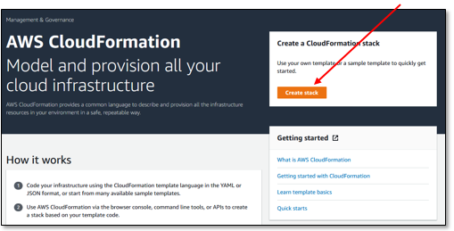
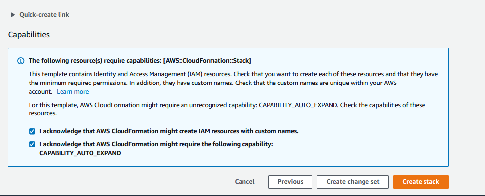
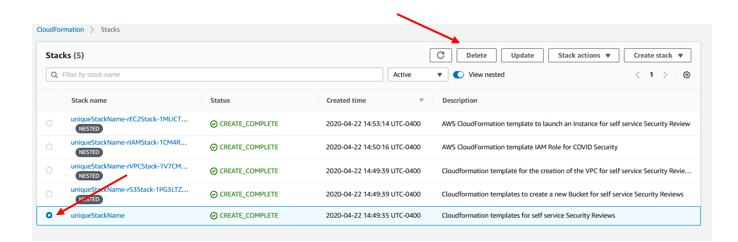

## Self-Service Security Assessment tool - Deployment guide

# REQUIREMENTS


## 1. Permissions

This process will require certain permissions to create a few resources in your Account. Ensure you are using a Role that has the ability to create the following resources


  1.	IAM Role
  2.	IAM Managed Policy
  3.	VPC
  4.	IGW
  5.	Route tables
  6.	Security Group
  7.	NAT Gateway
  8.	Elastic IP (EIP)
  9.	EC2 Instance
  10.	S3 Bucket

## 2. Check your Service Quotas (Limits)

In addition to the IAM Permissions you will need to verify that you will not run into an issue with Service Quotas.

The best place to check is with the [Service Quotas Console](https://console.aws.amazon.com/servicequotas/home)


# Create an S3 bucket
You will be deploying the scripts from the [GitHub page](https://github.com/awslabs/aws-security-assessment-solution/) into this bucket.  

The following [guide](https://docs.aws.amazon.com/AmazonS3/latest/gsg/CreatingABucket.html) can walk you through how to create an S3 bucket if you are not familiar. Make sure to note the name of the bucket that you create as we will need this in the next step.
  ` Note` - You need to deploy the cloudformation template in the same region as the bucket that you create

# Upload files to S3
Copy the uncompressed files from "CloudFormation-Templates" directory into your S3 bucket.  
* `Note` you will need the S3 URL of the SelfServiceSec.yml file

# Copy the S3 URL

* In the bucket that you just created and uploaded the files to, select the file name SelfServiceSec.yml
* In the resulting window at the bottom of the screen, copy the Object URL

### Example

__Object URL__   
https://s3-us-west-2.amazonaws.com/Your-Bucket-Name-Here/SelfServiceSec.yml

# CloudFormation Console


Go to the CloudFormation console and select “Create Stack"




# S3 Load the imported template

Select Amazon S3 URL as the source and copy and paste the S3 URL from the step above:


```bash
example:
https://s3-us-west-2.amazonaws.com/Your-Bucket-Name-Here/SelfServiceSec.yml
```

# Tagging, Advanced Options and Deploying the stack


## 1. Unique Stack Name

Enter a unique stack name

## Parameters

### S3 bucket name
* This is just the name of the new bucket where you have placed the files from "CloudFormation-Templates".  
   ` Note` - This is ONLY the **bucket name** (e.g. your-bucket-name) not the full S3 bucket URL

### Enable checks for common security mistakes module
* This will deploy several additional checks that will check for common security mistakes as highlighted in https://www.youtube.com/watch?v=tmuClE3nWlk   
`Note` - We may be adding more checks to this over time
### Enable ransomeware detection modules
* This will deploy several additional functions that can help you scan your environment for ransomware   
`Note` - We may be adding more modules to this over time

## 2. Tagging and Role for CloudFormation

Use tags per your organizational tagging policy and guidance.

If applicable to your organization use the appropriate Role for CloudFormation here. Otherwise leave this blank, and CloudFormation will use the permissions that you currently have (this is the default behavior).

## 3. Advanced Options

No Advanced Options are required.

# 4. Deploying the stack

On the next screen, before you select “Create Stack” be sure to check the two (2) check boxes



# Cleanup

Once you have both report you can remove the files from the S3 Bucket.

Once the S3 Bucket is empty you can go to CloudFormation and delete the CloudFormation stack.



IF the S3 Bucket is not empty *you will receive an error* when CloudFormation attempts to delete the S3 Bucket.

Simply delete the object
