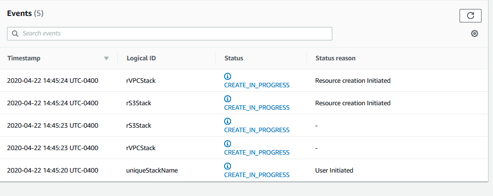
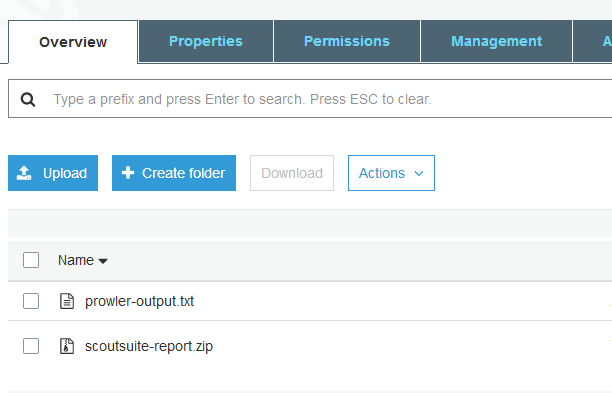

# Deployment status

> [!DANGER]
> IT WILL TAKE ABOUT 40 MINUTES TO AN HOUR OR SO FOR THE REPORTS TO COMPLETE

## Nested Stacks

The base template should deploy several other [nested stacks](https://docs.aws.amazon.com/AWSCloudFormation/latest/UserGuide/using-cfn-nested-stacks.html)

We are using Nested Stacks to make the overall deployment easier. This also allows us an ability to create distinct stacks for each "layer" of the solution (VPC, IAM, EC2, S3,)
+ Optionally Modules for Ransomware may also be loaded

## Status and errors

The should see the following nested stacks

  + VPC
  + IAM
  + S3
  + EC2

Sometimes a stack may not deploy. The *most common* issue is a Service Quota/Limit. Another issue could be the name of the IAM Role. Please ensure that you have the ability (rights) as well as capacity in your Account to deploy the necessary resources.

# S3 Bucket Name

Once the S3 Stack has completed, go to the "Outputs" tab and check the name of the S3 Bucket. This is where the Security Assessments will be delivered when the assessment is completed.

# Obtain the Security Assessment Reports

> [!DANGER]
> IT WILL TAKE ABOUT 40 MINUTES TO AN HOUR OR SO FOR THE REPORTS TO COMPLETE

After about *40 minutes* you should see two (2) reports delivered to the S3 Bucket that was created.

Download the reports locally and review.
